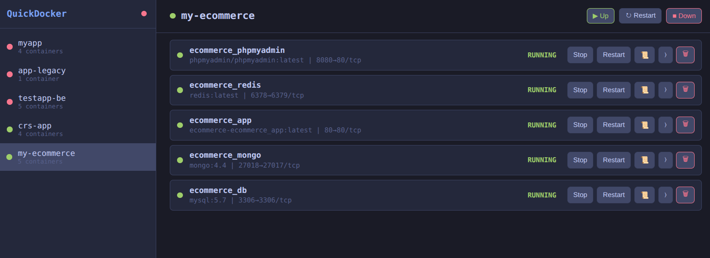

<div align="center">

# QuickDocker

**A fast, lightweight Docker manager for your desktop.**

Manage your Docker Compose projects and containers without the bloat of VS Code extensions or heavy Electron apps. Just a clean UI that launches in under a second.



[](#installation)
[](#installation)
[](#installation)
[](LICENSE)

</div>

---

## Why QuickDocker?

If you use Docker Compose daily, you know the pain: switching to the terminal to run `docker compose up`, checking which containers are running, tailing logs, opening a shell. VS Code's Docker extension works but it's sluggish and buried in a sidebar.

QuickDocker gives you:

- **Instant overview** - See all your Compose projects and their status at a glance
- **One-click actions** - Start, stop, restart projects and individual containers
- **Live logs with color** - Stream logs in real-time with full ANSI color support
- **Interactive shell** - Open a terminal into any running container, right from the UI
- **Auto-refresh** - State updates every 2 seconds, no manual refresh needed
- **Zero config** - Point it at your Docker daemon and it discovers everything

## Features

| Feature | Details |
|---|---|
| Compose project management | Auto-discovers projects, group actions (up/down/restart) |
| Container controls | Start, stop, restart, remove individual containers |
| Log streaming | Real-time SSE with ANSI color rendering |
| Interactive terminal | Full shell access via xterm.js + WebSocket |
| Live state updates | WebSocket polling every 2s |
| Dark theme | Tokyo Night color scheme, easy on the eyes |
| Two modes | Native desktop app (Tauri) or browser at `localhost:18093` |

## Installation

### Download (Recommended)

Grab the latest release for your OS from the [Releases](../../releases) page:

| OS | Package |
|---|---|
| Ubuntu / Debian / Pop!_OS | `QuickDocker_x.x.x_amd64.deb` |
| macOS | `QuickDocker_x.x.x_aarch64.dmg` |
| Windows | `QuickDocker_x.x.x_x64-setup.exe` |

**Linux:**
```bash
sudo dpkg -i QuickDocker_*.deb
```

**Prerequisites:** Docker must be installed and running. That's it.

### Run from source (no install needed)

```bash
git clone https://github.com/ants88/quick-docker.git
cd quick-docker
chmod +x run.sh
./run.sh
```

Opens in your browser at http://localhost:18093. Requires Python 3.10+ and Docker.

The script auto-creates a virtual environment and installs dependencies on first run.

## Architecture

```
┌─────────────────────────────────────────────┐
│  Tauri 2.x (native window, optional)        │
│  ┌────────────────────────────────────────┐  │
│  │  Frontend (vanilla HTML/CSS/JS)        │  │
│  │  xterm.js for terminal emulation       │  │
│  └──────────────┬─────────────────────────┘  │
│                 │ REST / SSE / WebSocket      │
│  ┌──────────────▼─────────────────────────┐  │
│  │  Backend (Python FastAPI)              │  │
│  │  Docker SDK + Compose subprocess       │  │
│  └──────────────┬─────────────────────────┘  │
└─────────────────┼───────────────────────────┘
                  │
          Docker Engine API
```

**Key design choices:**
- **SSE for logs** - Unidirectional, EventSource has native auto-reconnect
- **WebSocket for shell** - Bidirectional, supports resize + binary data
- **WebSocket polling for state** - Simple, reliable, small payload (~5KB)
- **No build step for frontend** - Vanilla JS, zero bundler complexity
- **PyInstaller sidecar** - Backend bundled as a single binary in the desktop app

## Development

### Build from source

```bash
# Prerequisites
sudo apt install python3-venv libwebkit2gtk-4.1-dev libgtk-3-dev \
  libjavascriptcoregtk-4.1-dev libsoup-3.0-dev librsvg2-dev patchelf
curl --proto '=https' --tlsv1.2 -sSf https://sh.rustup.rs | sh -s -- -y

# Build .deb
chmod +x build.sh
./build.sh
```

### Project structure

```
quick_docker/
├── backend/
│   ├── main.py              # FastAPI routes + WebSocket handlers
│   ├── docker_manager.py    # Docker SDK wrapper + Compose subprocess
│   └── run_server.py        # Standalone entry point (for PyInstaller)
├── frontend/
│   ├── index.html           # UI structure + modals
│   ├── style.css            # Tokyo Night dark theme
│   ├── app.js               # All frontend logic (~400 lines)
│   └── vendor/              # xterm.js (bundled, no CDN dependency)
├── src-tauri/               # Tauri 2.x desktop wrapper
├── run.sh                   # Dev launcher (browser mode)
└── build.sh                 # Build .deb / .dmg / .msi
```

### API

| Method | Endpoint | Description |
|---|---|---|
| `GET` | `/api/health` | Docker daemon health check |
| `GET` | `/api/projects` | List all Compose projects |
| `GET` | `/api/containers` | List all containers |
| `POST` | `/api/compose/{project}/{action}` | Compose up / down / restart |
| `POST` | `/api/container/{id}/{action}` | Container start / stop / restart |
| `DELETE` | `/api/container/{id}` | Remove container |
| `GET` | `/api/container/{id}/logs` | SSE log stream |
| `WS` | `/api/ws/events` | Live state broadcast (2s interval) |
| `WS` | `/api/ws/exec/{id}` | Interactive shell session |

## Troubleshooting

**App shows empty sidebar** - Make sure Docker is running: `docker info`

**Permission denied on Docker socket** - Add your user to the docker group:
```bash
sudo usermod -aG docker $USER
# Then log out and back in
```

**Port 18093 already in use** - Kill the existing process: `fuser -k 18093/tcp`

## Contributing

Contributions are welcome! Feel free to open issues and pull requests.

## License

MIT
